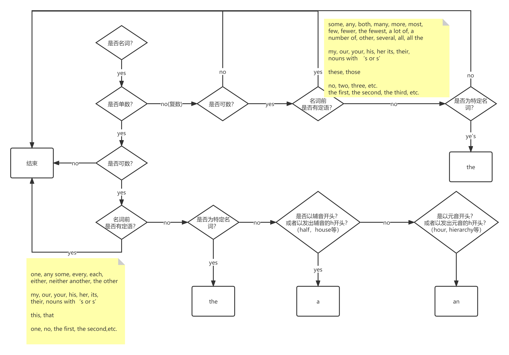

# 中英写作误区

[原文链接](https://www.chrisyttang.org/assets/misc/The%20Most%20Common%20Habits%20from%20more%20than%20200%20English%20Papers%20written.pdf)

## 目标

常见的中英写作误区，包括语法错误、口语化和格式问题，这会导致想法表达的不清晰。

## 第一部分

最需要注意的一些误区，出现频率很高，它会打断文章的连贯性，使文章难以理解。

### a,an,the

最常见的一个误区是省略冠词 “`a`,`an`,`the`”，因为在汉语中没有直接对应冠词。冠词表示后面会跟着一个名词，`a` 和 `an` 是不定冠词，表示以非特定或一般的方式指代一个项目；`the` 是定冠词，表示已知的指一个具体的项目。当一个单数的不可数名词或者一个可数的普通名词被使用时，这个名词需要某种限定词。

常见误区:

1. 需要的时候省略了
2. 在不需要的地方使用了
3. 错误的用来替代正确的冠词

#### 示例

- 错误：Figure 2 shows the distribution of relative velocity on surface of main and splitter blades.
- 正确：Figure 2 shows the distribution of relative velocity on **the** surface of **the** main and splitter blades.

---

- 错误：The software PowerSHAPE is chosen to be a 3D modeling tool; it is good at dealing with free surfaces and curves.
- 正确：The software PowerSHAPE is chosen to be **the** 3D modeling tool; it is good at dealing with free surfaces and curves.

> 这里只使用了一种 3D 建模工具，因此它是特定的，需要使用 `the`。

---

- 错误：A theoretical method for calculating the inner flow-field in centrifugal impeller with splitter blades and investigation of the interactions between main and splitter blades is presented in this paper. The vortices are distributed on the main and splitter blades to simulate the effects of flows. Systematical study of number and distribution of vortices is conducted.
- 正确：A theoretical method for calculating the inner flow-field in **a** centrifugal impeller with splitter blades and **an** investigation of the interactions between main and splitter blades is presented in this paper. The vortices are distributed on the main and splitter blades to simulate the effects of flows. **A** systematical study of **the** number and distribution of vortices is conducted.

---

- 错误：Theoretically, remanufacturing could fully take advantage of resources contained in EOF product thereby minimizing impact on environment to the greatest extent compared to landfill or recycling of materials; consequently it contributes greatly to resource conservation.
- 正确：Theoretically, remanufacturing could fully take advantage of resources contained in **an** EOF product thereby minimizing **the** impact on **the** environment to the greatest extent compared to landfill or recycling of materials; consequently it contributes greatly to resource conservation.

### 句子太长

在英文中，主要观点和每一个支撑观点应该写在单独的语句中。通过将每个句子限制在一个或两个主题上，可以避免长句子。分号应该用在真正想强调观点之间关系的地方。

- 太长：According to the characteristic of fan-coil air-conditioning systems, this paper derives the cooling formula of fan-coil units based on the heat transfer theories and puts forward a new method to gauge cooling named Cooling Metering on the Air-side, which can monitor the individual air-conditioning cooling consumption during a period of time by detecting the parameters of inlet air condition – temperature and humidity – of the fan-coil air-conditioning system as well as the parameters of inlet cooling water provided by the chiller.
- 正确：This paper derives the cooling formula of fan-coil units based on the characteristics of fan-coil air-conditioning systems and heat transfer theories, and puts forward a new method to gauge cooling called Cooling Metering on the Air-side. The new method can monitor individual air-conditioning cooling consumption during a period of time by detecting the condition of inlet air – temperature and humidity – of the fan-coil air-conditioning system as well as the parameters of the inlet cooling water provided by the chiller.

---

- 太长：The gear transmission is grade seven, the gear gap is 0.00012 radians, the gear gap has different output values corresponding to any given input value, nonlinearity of the gear gap model can be described by using the phase function method, the existing backlash block in the non-linear library of the Matlab/zdimulink toolbox can be used, the initial value of gear gap in the backlash block is set to zero.
- 正确：The gear transmission is grade seven. The gear gap, which is 0.00012 radians, has different output values corresponding to any given input value. The nonlinearity of the gear gap model can be described by using the phase function method. The existing backlash block in the non-linear library of the Matlab/zdimulink toolbox can be used; the initial value of gear gap in the backlash block is set to zero.

## 第二部分

通过例句和建议，提高对单词和语义之间细微差别的辨识。
